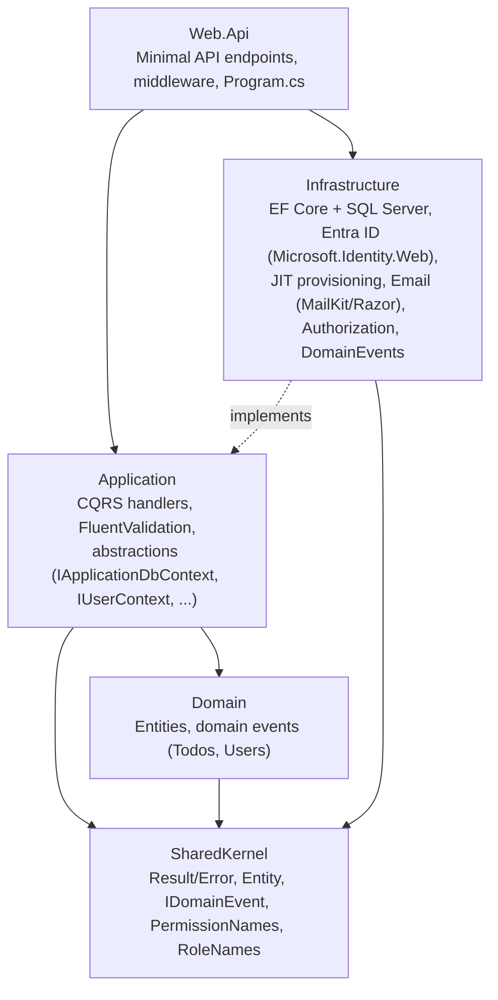
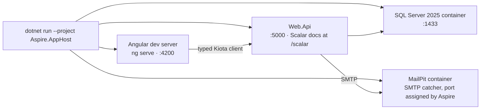

# Clean Architecture Template (.NET Aspire + SQL Server + Microsoft Entra ID + Angular)

A full-stack, pragmatic Clean Architecture starter for **internal enterprise applications**: a
**.NET 10** backend orchestrated by **.NET Aspire**, with **SQL Server** for storage,
**Microsoft Entra ID** for authentication and authorization, and an **Angular 20** frontend talking
to it through a typed client generated straight from the API's OpenAPI document. One command boots
the whole stack — database, mail catcher, API, and frontend — with real telemetry flowing into the
Aspire dashboard, **and with no Azure tenant required to run it**.

<p>
  
  
  
  
  <br>
  
  
  
  
  <br>
  
  
  
  
  <br>
  
  
  
  
</p>

## What scenario is this built for?

Teams in a **Microsoft/Windows-shop stack** (SQL Server, not Postgres) building an **internal
line-of-business application** whose users already exist in the organization's **Entra ID tenant** —
a back-office tool, an admin portal, an operations console. Nobody self-registers. There is no
anonymous audience. Employees sign in with the corporate account they already have, and IT grants
access by assigning an app role, through the joiner/mover/leaver process it already runs.

The application therefore stores **no passwords, no password hashes, and no roles**. Identity is
Microsoft's; the app validates the access token and reads its `roles` claim.

If instead you need an app that **owns its own accounts** — customers, external partners,
self-service registration and password resets — this is the wrong flavor. You want ASP.NET Core
Identity, which this template deliberately removed.

The design decisions, with the Microsoft guidance behind each one, are written down in
[`EntraIdMigration.md`](./EntraIdMigration.md). The Azure-side setup is
[`EntraIdSetup.md`](./EntraIdSetup.md).

## Architecture

Clean Architecture with strict, one-directional dependencies — `Infrastructure` implements
interfaces owned by `Application`, so `Application` never references EF Core, ASP.NET Core
Entra ID, or MailKit directly (`NetArchTest`-enforced in `tests/ArchitectureTests`):



**`Domain.Users.User` is not an identity store.** It holds a local primary key, the
`(EntraObjectId, EntraTenantId)` pair that links to the directory, a cached copy of name and email
for display and joins, and `IsActive`. No password, no password hash, no roles.

That last point is the load-bearing one: **authorization never reads this table**. Permissions are
derived from the access token's `roles` claim by `PermissionProvider`, a pure function with no
database access. If a `SELECT` ever appears in that path, the local role store has been
reintroduced through the back door.

Local development is one process tree, orchestrated by the Aspire AppHost:



## What's included

**Backend** (`src/backend/`)
- **CQRS, MediatR-free** — lightweight `ICommand`/`IQuery` + handler abstractions, discovered by
  Scrutor assembly scanning; logging and validation as decorators.
- **Persistence** — EF Core 10 + SQL Server, migrations, a domain-events dispatcher, and
  `IApplicationDbContext` as the only thing `Application` sees (real dependency inversion, not
  a direct `DbContext` reference).
- **Entra ID authentication** — `Microsoft.Identity.Web` validates access tokens, and the four
  claim validations Microsoft requires (audience, tenant, subject, actor) are all wired up. The
  identity key for local data is the `(oid, tid)` pair — never `oid` alone, never an email address.
- **Cloud-managed authorization** — Entra **App Roles** arrive in the `roles` claim and map to
  fine-grained permissions in code. `PermissionProvider` is a pure function of the token: no
  database, no role table. An integration test fails the build if any endpoint authorizes on
  authentication alone, which is what would otherwise quietly admit every service principal in the
  tenant.
- **Just-in-time provisioning** — there is no registration step, so a person's first authenticated
  request creates their local record from token claims. Rows are deactivated, never deleted, so a
  SCIM endpoint can be added later without reshaping the model.
- **Runs with no Azure tenant** — a Development-only authentication scheme stands in for Entra ID so
  a fresh clone boots from one command. Startup fails if it is ever configured elsewhere.
- **Email** — MailKit SMTP sender + precompiled, strongly typed Razor components with shared
  branding and layout (currently the welcome message, sent when a person is provisioned on first
  sign-in); routes to **MailPit** in `Development` so email actually sends without a real provider.
  See ["Email templates (Razor)"](#email-templates-razor) below for how the pieces fit together.
- **HybridCache** for fast, unified caching with invalidation.
- **Web API concerns** — Minimal API endpoints (auto-discovered), rate limiting (global +
  stricter auth policy, 429s shaped as `ProblemDetails` so generated clients never special-case
  them), global exception handling, Scalar API reference with JWT bearer support.
- **Observability** — full OpenTelemetry (ASP.NET Core, HTTP, SqlClient, EF Core, runtime),
  health checks, structured logging — wired once in `Aspire.ServiceDefaults` and shared by every
  Aspire-orchestrated project, flowing into the **Aspire dashboard** with zero extra setup.
- **Testing** — unit tests (`Application.UnitTests`), architecture tests enforcing the layering
  rules above (`ArchitectureTests`), and integration tests against a real, throwaway SQL Server
  container (`IntegrationTests`, via Testcontainers).

**Frontend** (`src/frontend/`)
- **Angular 20**, standalone components (no `NgModule`s), Tailwind CSS 4 for styling.
- **MSAL** (`@azure/msal-browser`) sign-in with Authorization Code + PKCE. There are no auth pages:
  sign-in, password reset and account recovery are Microsoft's screens. Token acquisition, caching
  and renewal are MSAL's job, attached to outgoing calls in exactly one place
  (`core/api-authentication-provider.ts`).
- Todos and Users (list/detail/admin-role) pages as reference CRUD screens.
- A **fully typed API client generated with Kiota** (`clients/api-client/`, gitignored) straight
  from the backend's OpenAPI document — every endpoint declares its error responses
  (`.ProducesProblem(...)`) so failures surface as real typed `ProblemDetails` objects in the
  frontend, not generic bodiless errors. Framework-agnostic by design, so a future React client
  could consume the exact same generated client without regenerating it.

## Getting started

**Prerequisites:** .NET 10 SDK, Node.js 20.19+ (Angular 20 requirement), Docker Desktop (for the
SQL Server and MailPit containers Aspire spins up).

**Give it room.** SQL Server 2025 in a container, the Docker VM, the API and the Angular dev server
together want roughly **4-5 GB of free RAM**. On a 16 GB machine also running a browser with many
tabs, the host will start killing processes — the symptom is confusing, because the Aspire console
still reports a healthy "distributed application started" while `curl` to the API hangs rather than
refusing the connection.

```bash
cd src/frontend && npm install   # first time only
cd ../..
dotnet run --project src/backend/Aspire.AppHost
```

This single command launches the Aspire dashboard, the SQL Server + MailPit containers, the API,
and the Angular dev server together — telemetry flows into the dashboard automatically, and the
API's migrations + Identity seed run on startup in `Development`.

| Resource | URL |
|---|---|
| Aspire dashboard | printed in the console on startup |
| Angular app | http://localhost:4200 |
| API (Scalar docs) | http://localhost:5000/scalar |
| MailPit (dev email inbox) | port assigned by Aspire — open it from the dashboard |
| SQL Server | `localhost,1433` |

No sign-in is required locally. With `AzureAd:ClientId` empty, the API authenticates every request
as the person described by the `DevelopmentAuthentication` section of
`src/backend/Web.Api/appsettings.Development.json`, and the Angular app skips MSAL entirely. Narrow
`DevelopmentAuthentication:Roles` to just `Member` to see what a non-administrator sees.

To authenticate against a real tenant:

```powershell
az login
./scripts/setup-entra.ps1
```

That creates both Entra ID app registrations, assigns you the roles, and stores the ids in .NET
user secrets — no tenant-specific value ever enters the repository, and the Angular app needs no
configuration because it reads `GET /auth-config` from the API. The manual portal equivalent, and
the reasoning behind each step, is in [`EntraIdSetup.md`](./EntraIdSetup.md).

Run the full test suite (integration tests spin up a throwaway SQL Server container, so Docker
must be running):

```bash
dotnet test CleanArchitecture.sln
```

If you change the `Domain`/`Infrastructure` model, add a new migration:

```bash
dotnet ef migrations add <MigrationName> --project src/backend/Infrastructure --startup-project src/backend/Web.Api
```

### Frontend: calling an endpoint

Angular calls the API through the Kiota-generated client — typed, no hand-written HTTP:

```typescript
private readonly apiClient = inject(ApiClientService).client;

async loadTodos(userId: string) {
  const todos = await this.apiClient.todos.get({ queryParameters: { userId } });
  // todos: TodoResponse[]
}
```

### Backend: a Minimal API endpoint

Auto-discovered, documented in Scalar at `/scalar`:

```csharp
// Web.Api/Endpoints/Todos/GetById.cs
internal sealed class GetById : IEndpoint
{
    public void MapEndpoint(IEndpointRouteBuilder app)
    {
        app.MapGet("todos/{id:guid}", async (
            Guid id,
            IQueryHandler<GetTodoByIdQuery, TodoResponse> handler,
            CancellationToken cancellationToken) =>
        {
            Result<TodoResponse> result = await handler.Handle(new GetTodoByIdQuery(id), cancellationToken);

            return result.Match(Results.Ok, CustomResults.Problem);
        })
        .Produces<TodoResponse>()
        .ProducesProblemResponses()
        .WithTags(Tags.Todos)
        .HasPermission(PermissionNames.TodosAccess);
    }
}
```

### Email templates (Razor)

Email bodies are Razor components rendered to HTML via `HtmlRenderer`, sent through
`IEmailService<TModel>`:

```csharp
public sealed class SendWelcomeEmailOnUserProvisioned(
    IEmailService<WelcomeEmailModel> emailService)
    : IDomainEventHandler<UserProvisionedDomainEvent>
{
    public async Task Handle(UserProvisionedDomainEvent domainEvent, CancellationToken ct)
    {
        await emailService.SendAsync(
            toEmail: "ada@example.com",
            toName: "Ada Lovelace",
            model: new WelcomeEmailModel(FirstName: "Ada"),
            cancellationToken: ct);
    }
}
```

### Regenerating the API client

The TypeScript client under `clients/api-client/` is generated output (gitignored) — never edit
it by hand. Regenerate it after changing any endpoint or contract:

```powershell
./scripts/generate-api-client.ps1
```

This builds `Web.Api` (which exports `src/backend/Web.Api/obj/openapi/Web.Api.json` at build
time), runs `dotnet kiota generate` against it, and **syncs the result into every frontend that
consumes it** — currently `src/frontend/src/app/api-client/` (also gitignored). That sync is what
Angular actually builds against, so always regenerate through this script rather than calling
`dotnet kiota generate` directly — doing so leaves Angular on a stale client with no error. Kiota
itself is a pinned local tool (`.config/dotnet-tools.json`) — `dotnet tool restore` picks it up
automatically, no global install needed.

## What's different from the Postgres/custom-auth flavor?

- **SQL Server** via `Microsoft.EntityFrameworkCore.SqlServer`, orchestrated by the Aspire
  AppHost (`Aspire.Hosting.SqlServer`) instead of PostgreSQL. PascalCase EF Core conventions —
  no snake-casing, that's a Postgres idiom.
- **Microsoft Entra ID** replaces both the hand-rolled `User` entity with its `PasswordHasher` and
  the ASP.NET Core Identity flavor that preceded this one. There is no credential storage of any
  kind: `ApplicationDbContext` is a plain `DbContext` and the seven Identity tables are gone.
- Roles live in the directory, not the database. `Application` sees the caller through
  `IUserContext` (local id, tenant, App Roles); the local `User` row is a display cache, and
  authorization never reads it.
- **Scalar** + the native `Microsoft.AspNetCore.OpenApi` generator instead of Swashbuckle.
- Integration tests use `Testcontainers.MsSql` instead of `Testcontainers.PostgreSql`.
- `SSH.NET` and `Microsoft.OpenApi` are pinned in `Directory.Packages.props`
  (`CentralPackageTransitivePinningEnabled`) — both are transitive dependencies with known
  high-severity advisories below the pinned versions (GHSA-q939-rpr3-3284, GHSA-v5pm-xwqc-g5wc).
- A Kiota-generated TypeScript client shared by Angular (and, by design, any future React
  frontend) instead of hand-written HTTP calls per framework.

If you're ready to learn more, check out [**Pragmatic Clean Architecture**](https://www.milanjovanovic.tech/pragmatic-clean-architecture?utm_source=ca-template):

- Domain-Driven Design
- Role-based authorization
- Permission-based authorization
- Distributed caching with Redis
- OpenTelemetry
- Outbox pattern
- API Versioning
- Unit testing
- Functional testing
- Integration testing

## Claude Code skills

This repo ships a skill pack in `.claude/skills/` that teaches [Claude Code](https://claude.com/claude-code)
this template's conventions — the four backend layers, the `IApplicationDbContext` boundary, the
`.ProducesProblemResponses()` requirement, and the Kiota → Angular sync — so features it scaffolds
match what's already here instead of drifting into a generic pattern.

**How it works:** the skills live in `.claude/skills/` and need no install step — open this repo in
Claude Code and it lists them automatically at the start of every session. Claude is expected to
pick the matching skill on its own when a request fits one, e.g. "add support for tracking
invoices" → `add-entity`. That auto-triggering isn't a hard guarantee — it depends on how closely
your request's wording matches the skill's description — so if one doesn't fire when you expect,
invoke it explicitly with `/skill-name`. This only works inside Claude Code (or another tool with
the same skill-discovery mechanism); a teammate on a different assistant can still open the plain
Markdown files directly.

| Skill | Invoke with | What it does |
|---|---|---|
| **add-entity** | `/add-entity Project with a name and owner` | Domain entity, error catalog, domain events, EF configuration, and migration — including the `DbSet` wiring across all three places it's needed (`IApplicationDbContext`, `ApplicationDbContext`, `TestDbContext`). |
| **add-feature** | `/add-feature archive a todo item` | A full use case across `Application` (command/query, handler, validator) and `Web.Api` (endpoint with typed `ProblemDetails`), plus — on request — the Kiota regen and an Angular page wired to it. |
| **add-tests** | `/add-tests CompleteTodoCommand` | Backfills handler unit tests, validator tests, and HTTP integration tests, or establishes an Angular/Jasmine testing baseline. |
| **clean-architecture-review** | `/clean-architecture-review` | Reviews a diff against this template's conventions before you commit — layer boundaries, endpoint contracts, permission wiring, Kiota freshness. |

```
/add-feature let a user snooze a todo until a given date
```

runs the whole chain: the `Application`/`Web.Api` slice, the Kiota regen, and (if you want it) the
Angular control — finish with `/add-tests SnoozeTodoCommand` and `/clean-architecture-review`
before committing. Full details, including how to copy this skill pack into another project based
on this template, are in [`.claude/skills/README.md`](.claude/skills/README.md).

## License

MIT — see [LICENSE](./LICENSE). This template is derived from
[amantinband/clean-architecture](https://github.com/amantinband/clean-architecture)
(Copyright (c) 2023 Amichai Mantinband).

Stay awesome!
