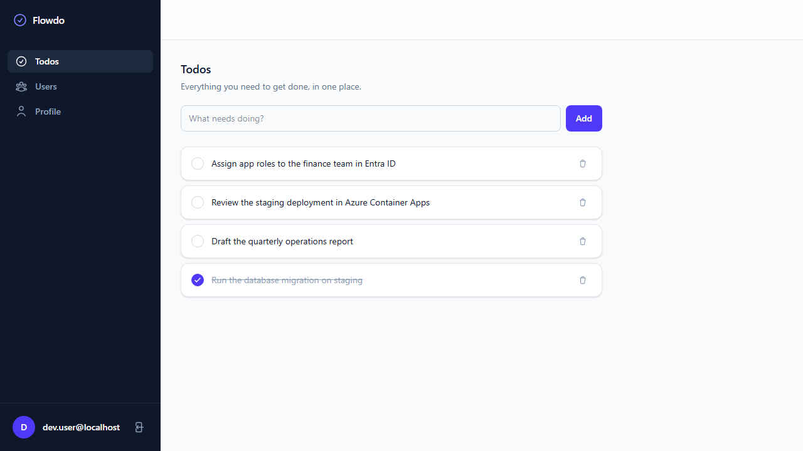

# Clean Architecture Template — .NET Aspire · SQL Server · Entra ID · Angular

A starter repository for **internal business applications** built with .NET and Angular. Instead of
wiring a new project from scratch, you start from one where the layers, sign-in, database, email,
tests, typed API client and Azure infrastructure already work together, and you replace the sample
feature with your own.

Users sign in with **Microsoft Entra ID**, so the app stores no passwords and no roles: identity and
access come from the organization's tenant. A .NET 10 API and an Angular 22 app run together under
.NET Aspire with one command, and **no Azure tenant is needed to try it** — locally you are signed in
as a development user.

The sample app, *Flowdo*, is a small to-do list with a users page and a profile page. It exists to
show one feature crossing every layer, from the database table to the Angular page.

<p>
  
  
  
  
  <br>
  
  
  
  
  <br>
  
  
  
  
  <br>
  
  
  
  
</p>



## Quick start

You need the .NET 10 SDK, Node.js 22.22.3+ or 24.15+, and Docker Desktop **running**. In PowerShell,
from the repository root:

```powershell
./scripts/setup-dev.ps1                            # first time only
dotnet run --project src/backend/Aspire.AppHost    # every time
```

| Open | Where |
|---|---|
| Angular app | http://localhost:4200 — no sign-in needed locally |
| API reference (Scalar) | http://localhost:5000/scalar |
| Aspire dashboard | URL printed in the console |
| MailPit inbox | Link in the Aspire dashboard |

The first run downloads the SQL Server image and can take a few minutes. Stop everything with
`Ctrl+C`. Run `setup-dev.ps1` again after changing an API contract: it reinstalls the npm packages
and regenerates the API client.

To sign in with a real Entra ID tenant instead of the local development user:

```powershell
az login
./scripts/setup-entra.ps1   # creates both app registrations and stores their ids in user secrets
```

## When to use it

**Use it** for a back-office tool, admin portal or operations console where every user already has
an account in the organization's Entra ID tenant, and IT grants access by assigning app roles.

**Don't use it** if the app must own its accounts — customers, external partners, self-registration
or password resets. That needs ASP.NET Core Identity, which this template deliberately removed.

## Architecture


Dependencies point inward. `Application` defines the interfaces it needs, and `Infrastructure`
implements them, so `Application` never references EF Core, Entra ID libraries or MailKit. The
architecture tests in `tests/ArchitectureTests` fail the build if a layer breaks this rule.

### Components

| Project | What it does | References |
|---|---|---|
| `SharedKernel` | `Result` and `Error`, base `Entity`, domain-event contracts, permission and role names | — |
| `Domain` | Entities (`User`, `TodoItem`) and their domain events | SharedKernel |
| `Application` | Use cases as command and query handlers, validation, and the interfaces they need (`IApplicationDbContext`, `IUserContext`, `IEmailService<T>`) | Domain |
| `Infrastructure` | Implements those interfaces: EF Core with SQL Server, Entra ID token validation, permissions, user provisioning, email | Application |
| `Web.Api` | Minimal API endpoints, middleware, and the startup that wires everything together | Application, Infrastructure |
| `Aspire.AppHost` | Starts and connects the local environment | Web.Api, frontend |
| `Aspire.ServiceDefaults` | OpenTelemetry, health checks and resilience shared by every .NET project | — |
| `src/frontend` | Angular 22 single-page app | Generated API client |
| `tests/` | Unit, architecture, infrastructure and integration tests | — |

### Identity and permissions

- **Authentication.** The API validates Entra ID access tokens, including the audience, tenant,
  subject and actor checks Microsoft requires.
- **Authorization.** App roles arrive in the token's `roles` claim. `PermissionProvider` maps them to
  permissions in code, without reading the database. An integration test fails if any endpoint
  allows access based on authentication alone.
- **Local user record.** A person's first request creates a `User` row from the token: a local id,
  the `(EntraObjectId, EntraTenantId)` pair, a cached name and email, and `IsActive`. It holds no
  password and no roles, and rows are deactivated, never deleted.
- **User administration.** The Users page lists the people who have signed in, with 20 users per
  page, status and actions for administrators. `GET /users` accepts `pageNumber`, `pageSize` (1–100)
  and `includeInactive`; the query is tenant-scoped, read-only, projected to a DTO, ordered by
  name and local id, and backed by a covering SQL index. `PUT /users/{userId}/status` changes local
  access. The page's **Delete** action calls `DELETE /users/{userId}`, which deactivates access
  without removing the row or its historical references. An administrator can reactivate it from
  the detail page. The API refuses self-deactivation. Names, email and role assignments remain
  managed in Entra ID.
- **Local development.** With `AzureAd:ClientId` empty, a Development-only scheme signs every
  request in as the user in the `DevelopmentAuthentication` section of
  `src/backend/Web.Api/appsettings.Development.json`. Set its `Roles` to `Member` to see what a
  non-administrator sees. Startup fails if this scheme is enabled outside Development.

### Local development with Aspire



The numbers are the start order: each resource waits until the previous step is ready. The API
applies EF Core migrations on startup in Development, and its telemetry shows up in the Aspire
dashboard.

## Technologies

### Backend

| Area | Technology | Role |
|---|---|---|
| Use cases | CQRS without MediatR, Scrutor | Command and query handlers found by assembly scanning; logging and validation as decorators |
| Persistence | EF Core 10, SQL Server | Migrations and domain-event dispatch behind `IApplicationDbContext` |
| Authentication | Entra ID, `Microsoft.Identity.Web` | Access-token validation; identity key `(oid, tid)` |
| Authorization | Entra app roles | Roles mapped to permissions in code, no role table |
| Email | MailKit, Razor views, MailPit | Typed HTML templates sent over SMTP; MailPit catches them locally |
| Caching | HybridCache | Unified caching with invalidation |
| HTTP API | Minimal APIs, Scalar | Auto-discovered endpoints, rate limiting, errors as `ProblemDetails` |
| Observability | OpenTelemetry, Aspire dashboard | Traces, metrics, structured logs and health checks |
| Testing | xUnit, NetArchTest, Testcontainers | Unit, architecture and integration tests against a real SQL Server container |

### Frontend

| Area | Technology | Role |
|---|---|---|
| UI | Angular 22, Tailwind CSS 4 | Standalone components, no `NgModule`s |
| Sign-in | MSAL (`@azure/msal-browser`) | Authorization Code with PKCE; Microsoft hosts the sign-in screens |
| API client | Kiota | Typed client generated from the API's OpenAPI document |
| Testing | Vitest, jsdom | Component and service tests through the Angular CLI |

## Development guide

### Add an endpoint (backend)

Endpoints are discovered automatically and appear in Scalar. Each one calls a handler, turns the
`Result` into an HTTP response, declares its error responses, and requires a permission:

```csharp
// src/backend/Web.Api/Endpoints/Todos/GetById.cs
internal sealed class GetById : IEndpoint
{
    public void MapEndpoint(IEndpointRouteBuilder app)
    {
        app.MapGet("todos/{id:guid}", async (
            Guid id,
            IQueryHandler<GetTodoByIdQuery, TodoResponse> handler,
            CancellationToken cancellationToken) =>
        {
            Result<TodoResponse> result = await handler.Handle(new GetTodoByIdQuery(id), cancellationToken);

            return result.Match(Results.Ok, CustomResults.Problem);
        })
        .Produces<TodoResponse>()
        .ProducesProblemResponses()            // typed errors in the generated client
        .WithTags(Tags.Todos)
        .HasPermission(PermissionNames.TodosAccess);
    }
}
```

If you change the domain model, add a migration:

```powershell
dotnet ef migrations add <MigrationName> --project src/backend/Infrastructure --startup-project src/backend/Web.Api
```

### Call it from Angular (frontend)

Angular uses the Kiota-generated client, so every call is typed and there is no hand-written HTTP.
MSAL attaches the access token in one place (`core/api-authentication-provider.ts`):

```typescript
// src/frontend/src/app/todos/todos-page.component.ts
private readonly apiClient = inject(ApiClientService).client;

async loadTodos(userId: string) {
  const todos = await this.apiClient.todos.get({ queryParameters: { userId } });
  // todos: TodoResponse[]; failures arrive as typed ProblemDetails
}
```

After changing an endpoint or contract, regenerate the client:

```powershell
./scripts/generate-api-client.ps1
```

The script builds `Web.Api`, generates the client from its OpenAPI document, and copies it into
`src/frontend/src/app/api-client/`. Always use the script: running `dotnet kiota generate` directly
leaves Angular on a stale client without any error.

### Send an email

The welcome message is sent after a person's first sign-in:

1. `UserProvisioningMiddleware` creates the local `User` and raises `UserProvisionedDomainEvent`.
2. `SaveChangesAsync` saves the user, then dispatches the event.
3. `SendWelcomeEmailOnUserProvisioned` asks `IEmailService<WelcomeEmailModel>` to send it.
4. `Infrastructure` renders the Razor template to HTML and delivers it over SMTP with MailKit.

The files are organized around the typed model, a view for each email, and a shared layout:

```text
src/backend/
├── Application/Abstractions/Email/Models/WelcomeEmailModel.cs
├── Infrastructure/
│   ├── Email/
│   │   ├── IRazorEmailRenderer.cs
│   │   ├── RazorEmailRenderer.cs
│   │   └── Templates/WelcomeEmailTemplate.cs
│   └── Views/
│       ├── _ViewImports.cshtml
│       ├── Emails/WelcomeEmail.cshtml
│       └── Shared/_EmailLayout.cshtml
└── Web.Api/DependencyInjection.cs
```

The call chain is `handler → IEmailService<WelcomeEmailModel> → WelcomeEmailTemplate →
RazorEmailRenderer → WelcomeEmail.cshtml + _EmailLayout.cshtml → IEmailSender`.

**1. Model and view.** The model lives in `Application`; the `.cshtml` view declares its type and
chooses the shared layout. `_ViewImports.cshtml` imports the model's namespace. Razor HTML-encodes
`@Model.FirstName`, so a name such as `<Ada>` appears as text rather than markup. A renamed model
property used by the compiled view fails the build.

```csharp
// Application/Abstractions/Email/Models/WelcomeEmailModel.cs
public sealed record WelcomeEmailModel(string FirstName);
```

```cshtml
@* Infrastructure/Views/_ViewImports.cshtml (relevant import) *@
@using Application.Abstractions.Email.Models
```

```cshtml
@* Infrastructure/Views/Emails/WelcomeEmail.cshtml *@
@model WelcomeEmailModel

@{
    Layout = "/Views/Shared/_EmailLayout.cshtml";
}

<h1 style="margin:0 0 16px;font-size:20px;color:#111827;">Welcome, @Model.FirstName!</h1>
<p style="margin:0 0 16px;">Your account has been created. We're glad to have you on board.</p>
```

The shared layout owns the outer HTML, branding and footer. Its `@RenderBody()` call inserts the
content of `WelcomeEmail.cshtml`:

```cshtml
@* Infrastructure/Views/Shared/_EmailLayout.cshtml (excerpt) *@
@inject IOptions<EmailBrandingOptions> BrandingOptions
@inject IDateTimeProvider Clock

<table role="presentation" width="480" cellpadding="0" cellspacing="0">
    <tr>
        <td style="background-color:@BrandingOptions.Value.PrimaryColor;padding:24px 32px;">
            @BrandingOptions.Value.AppName
        </td>
    </tr>
    <tr>
        <td style="padding:32px;">@RenderBody()</td>
    </tr>
    <tr>
        <td>
            &copy; @Clock.UtcNow.Year @BrandingOptions.Value.AppName.
            Contact @BrandingOptions.Value.SupportEmail.
        </td>
    </tr>
</table>
```

**2. Render the view.** `RazorEmailRenderer` finds the compiled view by path and executes it into a
`StringWriter`. The synthetic `ActionContext` lets MVC render an email outside an HTTP request; its
`RequestServices` is the current dependency injection scope. The essential implementation is:

```csharp
internal interface IRazorEmailRenderer
{
    Task<string> RenderAsync<TModel>(
        string viewPath, TModel model, CancellationToken cancellationToken = default)
        where TModel : notnull;
}

internal sealed class RazorEmailRenderer(
    IRazorViewEngine viewEngine,
    ITempDataProvider tempDataProvider,
    IModelMetadataProvider metadataProvider,
    IServiceProvider services) : IRazorEmailRenderer
{
    public async Task<string> RenderAsync<TModel>(
        string viewPath, TModel model, CancellationToken cancellationToken = default)
        where TModel : notnull
    {
        cancellationToken.ThrowIfCancellationRequested();

        var actionContext = new ActionContext(
            new DefaultHttpContext { RequestServices = services },
            new RouteData(),
            new ActionDescriptor());

        ViewEngineResult viewResult = viewEngine.GetView(
            executingFilePath: null, viewPath, isMainPage: true);

        if (!viewResult.Success || viewResult.View is null)
            throw new InvalidOperationException($"Email view not found: {viewPath}.");

        var viewData = new ViewDataDictionary<TModel>(metadataProvider, new ModelStateDictionary())
        {
            Model = model
        };

        using var writer = new StringWriter();
        var viewContext = new ViewContext(
            actionContext,
            viewResult.View,
            viewData,
            new TempDataDictionary(actionContext.HttpContext, tempDataProvider),
            writer,
            new HtmlHelperOptions());

        await viewResult.View.RenderAsync(viewContext);
        cancellationToken.ThrowIfCancellationRequested();
        return writer.ToString();
    }
}
```

**3. Choose the view and send it.** `WelcomeEmailTemplate` supplies the fixed view path and subject.
`EmailService<TModel>` takes its `RenderedEmail` and passes the HTML to the configured `IEmailSender`.
The application handler knows only the recipient and model:

```csharp
// Infrastructure/Email/Templates/WelcomeEmailTemplate.cs
internal sealed class WelcomeEmailTemplate(
    IRazorEmailRenderer renderer,
    IOptions<EmailBrandingOptions> branding) : IEmailTemplate<WelcomeEmailModel>
{
    public async Task<RenderedEmail> RenderAsync(
        WelcomeEmailModel model, CancellationToken cancellationToken = default)
    {
        string html = await renderer.RenderAsync(
            "/Views/Emails/WelcomeEmail.cshtml", model, cancellationToken);

        return new RenderedEmail($"Welcome to {branding.Value.AppName}!", html);
    }
}
```

```csharp
// Infrastructure/Email/EmailService.cs (excerpt)
RenderedEmail email = await template.RenderAsync(model, cancellationToken);
await sender.SendAsync(
    new EmailMessage(toEmail, toName, email.Subject, email.HtmlBody),
    cancellationToken);

// Application/Users/Provisioned/SendWelcomeEmailOnUserProvisioned.cs (excerpt)
await emailService.SendAsync(
    recipient.Email,
    $"{recipient.FirstName} {recipient.LastName}".Trim(),
    new WelcomeEmailModel(recipient.FirstName),
    cancellationToken);
```

**4. Register the compiled views and services.** These are the relevant registrations from the
existing projects:

```xml
<!-- Infrastructure/Infrastructure.csproj -->
<PropertyGroup>
  <AddRazorSupportForMvc>true</AddRazorSupportForMvc>
</PropertyGroup>
```

```csharp
// Web.Api/DependencyInjection.cs, inside AddPresentation
services.AddControllersWithViews()
    .AddApplicationPart(typeof(global::Infrastructure.DependencyInjection).Assembly);

// Infrastructure/DependencyInjection.cs, inside AddEmail
services.AddScoped(typeof(IEmailService<>), typeof(EmailService<>));
services.AddScoped<IRazorEmailRenderer, RazorEmailRenderer>();
services.AddScoped<IEmailTemplate<WelcomeEmailModel>, WelcomeEmailTemplate>();
```

Where the email ends up depends on configuration:

| Configuration found | Sender | Destination |
|---|---|---|
| `ConnectionStrings:mailpit` (set by the AppHost) | `SmtpEmailSender` | MailPit inbox |
| `Smtp:Host` | `SmtpEmailSender` | Your SMTP provider |
| Neither | `LoggingEmailSender` | Application log only |

Email is best effort: errors are logged and never undo the saved user, and there is no retry
queue. If delivery must be guaranteed, add a durable queue or an Outbox.

<details>
<summary>Adding another email</summary>

```csharp
// 1. Application/Abstractions/Email/Models — the data the view needs
public sealed record TodoReminderEmailModel(string FirstName, string Description);

// 2. Infrastructure/Email/Templates — the subject and view path
internal sealed class TodoReminderEmailTemplate(IRazorEmailRenderer renderer)
    : IEmailTemplate<TodoReminderEmailModel>
{
    public async Task<RenderedEmail> RenderAsync(
        TodoReminderEmailModel model, CancellationToken cancellationToken = default) =>
        new("A todo is due soon", await renderer.RenderAsync(
            "/Views/Emails/TodoReminderEmail.cshtml", model, cancellationToken));
}

// 3. Infrastructure/DependencyInjection.cs, inside AddEmail
services.AddScoped<IEmailTemplate<TodoReminderEmailModel>, TodoReminderEmailTemplate>();
```

Create `Infrastructure/Views/Emails/TodoReminderEmail.cshtml` with
`@model TodoReminderEmailModel`, the shared layout path, and the email body. The renderer is already
registered once for all email views.

Any handler can then inject `IEmailService<TodoReminderEmailModel>`; `IEmailService<>` is already
registered as an open generic.

</details>

### Run the tests

```powershell
dotnet test CleanArchitecture.sln                    # backend; Docker must be running
cd src/frontend; npm test -- --watch=false           # frontend
```

<details>
<summary>More checks</summary>

- `npm run build` in `src/frontend` builds the production bundle.
- `npm audit` and `npm audit --omit=dev` separate tooling issues from production dependencies.
- `./scripts/test-clean-setup.ps1` copies the repository to a temporary folder, without generated
  clients or local secrets, and checks that setup and build work from scratch.
- `./scripts/test-generate-api-client.ps1` checks that a failed client generation keeps the
  previous client. It does not need Docker.
- Frontend tests use simulated DOM; real Entra ID redirects still need a browser and a tenant.

</details>

## Azure deployment


The `infra/` folder defines the Azure resources with **Bicep**. Each environment has its own
`.bicepparam` file and is deployed to its own resource group with Azure CLI. Front Door is the only
public entry: it sends `/api/*` to the API and everything else to Angular, through Private Link
connections that must be approved after the first deployment.

| Environment | API and web replicas | Azure SQL | WAF | Availability |
|---|---|---|---|---|
| `dev` | 1, fixed | Basic | Detection | Single replica, no zone redundancy |
| `staging` | 1 to 3, automatic | S1 | Detection | No zone redundancy |
| `prod` | 2 to 10, automatic | General Purpose, 2 vCores | Prevention | Zone-redundant Container Apps and SQL |

Container Apps scales each app on concurrent HTTP requests (10 per replica by default). Front Door
routes and protects traffic; there is one origin per route and no second region.

Required variables, permissions, Private Link approval and deployment commands are in
[infra/README.md](infra/README.md).

## Reference

<details>
<summary>Machine requirements and common problems</summary>

- SQL Server in a container, the Docker VM, the API and the Angular dev server need about
  **4–5 GB of free RAM**.
- If memory runs out, the host kills processes. The Aspire console still says the application
  started, but requests to the API hang instead of being refused. Close other apps and restart.
- The first run pulls the SQL Server 2025 image, which takes a few minutes.

</details>

<details>
<summary>Request processing, limits and health checks</summary>

- Authentication runs before rate limiting, permission checks and user provisioning.
- Rate limits use the tenant and object ids for signed-in users and the connection IP for anonymous
  requests. Forwarded headers are not trusted automatically.
- Limits apply **per API instance**: each replica has its own quota, so they are not a shared
  global limit.
- `/alive` checks the process and `/ready` checks SQL with a separate connection and short
  timeouts. Both are public and skip rate limiting and user provisioning.
- `/auth-config` gives Angular its sign-in settings. It skips provisioning but is rate limited.
- Deactivated local users are rejected on protected endpoints.
- User endpoints need a valid `oid` and `tid`, the delegated `access_as_user` scope and an
  assigned role. Application principals are rejected. Only the Development scheme is exempt from
  the scope check.
- `GET /users` defaults to page 1, size 20. Pages start at 1, sizes go from 1 to 100, and invalid
  values return `400` with `Users.InvalidPagination`. Results are ordered by first name, last
  name, then id.

</details>

<details>
<summary>Configuration outside Development</summary>

- Staging and production need all three `AzureAd` values: `TenantId`, `ClientId` and
  `SpaClientId`. If any is missing, the API returns `503` and never falls back to development
  sign-in.
- Angular needs no configuration of its own: it reads `GET /auth-config` from the API.
- `setup-entra.ps1` stores tenant-specific ids in .NET user secrets, never in the repository.
  Review the app registrations and roles it creates before using them in a shared tenant.
- Configure SMTP (`Smtp:*`) before relying on email delivery.

</details>

<details>
<summary>Differences from the PostgreSQL / custom-auth version</summary>

- **SQL Server** instead of PostgreSQL, with PascalCase EF Core naming instead of snake_case.
- **Entra ID** replaces the hand-rolled `User` with `PasswordHasher` and the earlier ASP.NET Core
  Identity version. There is no credential storage: `ApplicationDbContext` is a plain `DbContext`.
- Roles live in the directory. `Application` sees the caller through `IUserContext` (local id,
  tenant, app roles); the local `User` row is only a display cache.
- **Scalar** and the built-in OpenAPI generator replace Swashbuckle.
- Integration tests use `Testcontainers.MsSql`.
- A Kiota-generated TypeScript client replaces hand-written HTTP calls.
- `SSH.NET` and `Microsoft.OpenApi` are pinned in `Directory.Packages.props` because older
  transitive versions have high-severity advisories (GHSA-q939-rpr3-3284, GHSA-v5pm-xwqc-g5wc).

</details>

## Claude Code skills

`.claude/skills/` contains skills that teach [Claude Code](https://claude.com/claude-code) this
template's conventions, so new features follow the existing layers and contracts. Claude Code loads
them automatically when you open the repository; if one doesn't trigger, call it with
`/skill-name`.

| Skill | Example | What it does |
|---|---|---|
| **add-entity** | `/add-entity Project with a name and owner` | Entity, errors, domain events, EF configuration and migration |
| **add-feature** | `/add-feature archive a todo item` | Command or query, handler, validator and endpoint; optionally the client regeneration and an Angular page |
| **add-tests** | `/add-tests CompleteTodoCommand` | Handler, validator and integration tests, or an Angular test baseline |
| **clean-architecture-review** | `/clean-architecture-review` | Reviews a diff against the template's conventions before you commit |

Details, including how to reuse the skills in another project, are in
[.claude/skills/README.md](.claude/skills/README.md).

## License

[MIT License](./LICENSE). Copyright (c) 2023 Amichai Mantinband; 2026 Alvaro I. Hernández Rodríguez.

The backend started from Milan Jovanović's free
[Clean Architecture Template](https://www.milanjovanovic.tech/templates/clean-architecture).
